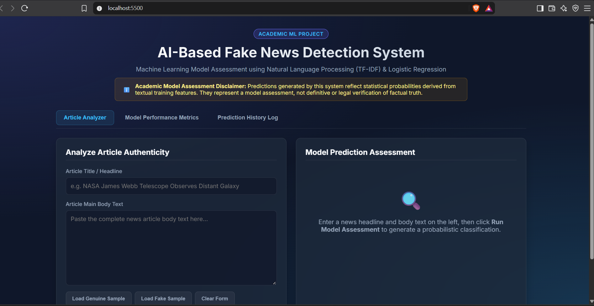

# AI-Based Fake News Detection System

An academic Machine Learning web application designed to assess whether news articles (headlines and body text) exhibit statistical patterns associated with fake news or genuine news using Natural Language Processing (TF-IDF) and Logistic Regression.

> **Academic ML Disclaimer**: Predictions generated by this system represent probabilistic model assessments based on learned textual features from training datasets. They do not constitute absolute truth or factual verification of news claims.

## Tech Stack
- **Python**: 3.11+
- **Backend Framework**: FastAPI
- **Machine Learning**: scikit-learn (TF-IDF Vectorizer + Logistic Regression)
- **Data Manipulation**: pandas, NumPy
- **Natural Language Processing**: NLTK (Stopwords, WordNet Lemmatizer)
- **Database**: SQLite
- **Frontend**: HTML5, Vanilla CSS3 (Dark Glassmorphic UI), JavaScript (ES6 Fetch)

## Folder Structure
```
FakeNewsDetection/
├── app/
│   ├── main.py                  # FastAPI application entrypoint & API routes
│   ├── config.py                # Environment configuration & constants
│   ├── database.py              # SQLite database setup & connection pool
│   ├── models.py                # Pydantic schemas & SQLite database models
│   ├── ml/
│   │   ├── preprocessor.py      # NLTK text normalization pipeline
│   │   ├── predictor.py         # Model loader & inference service
│   │   ├── train.py             # Model training & metrics exporter
│   │   └── dataset_generator.py # Synthetic/sample dataset generator
│   ├── static/
│   │   ├── css/styles.css       # Frontend stylesheets
│   │   └── js/app.js           # Client-side JavaScript
│   └── templates/
│       └── index.html           # Main SPA interface
├── data/
│   ├── raw/                     # Raw CSV datasets
│   └── processed/               # Preprocessed dataset cache
├── saved_models/
│   ├── model.pkl                # Serialized Logistic Regression model
│   ├── vectorizer.pkl           # Serialized TF-IDF vectorizer
│   └── metrics.json             # Evaluation metrics
├── tests/                       # Unit & integration tests
├── requirements.txt             # Project dependencies
└── README.md                    # Project documentation
```

## Quick Start Guide

### 1. Install Dependencies
Run the single setup command to install both Node packages and Python requirements into `./venv`:
```bash
npm run setup
```

### 2. Generate Sample Dataset & Train Model (First Time Setup)
```bash
python -m app.ml.dataset_generator
python -m app.ml.train
```

### 3. Launch Development Environment
Start both the FastAPI backend (`http://127.0.0.1:8000`) and the frontend development server (`http://127.0.0.1:5500`) automatically with a single command:
```bash
npm run dev
```

- **Frontend Server**: [http://127.0.0.1:5500](http://127.0.0.1:5500)
- **FastAPI Backend**: [http://127.0.0.1:8000](http://127.0.0.1:8000)

## Testing
To run the automated test suite:
```bash
pytest
```
## Screenshots
### Home Page



### Prediction Result


